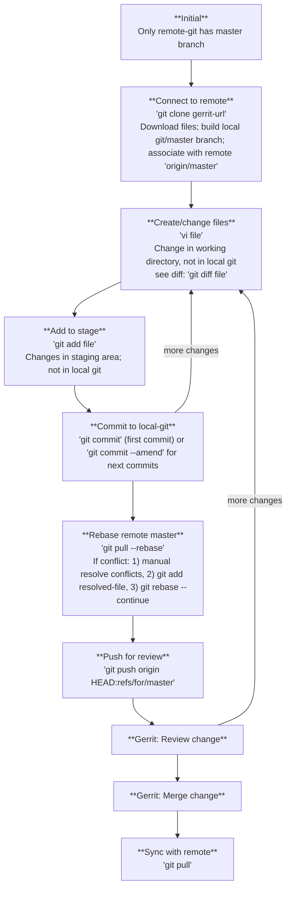

### Workflow for git with Gerrit

#### Entities:
1. Remote-git: Gerrit
2. Local-git: Local repository
3. Staging: `git add`
4. Disk: working directory

#### Stages:
1. **Pre-requisite**:
   - Install git: `git --version`
   - Set user name and email: `git config --global user.name "Your Name"`, `git config --global user.email "your email"`
2. **Initial**:
   - Only the remote repository has the master branch.
3. **Clone to local**: `git clone <gerrit-url>`
   - Example: `git clone https://fetch-gerrit.dyn.nutanix.com/nutest-py3-tests`
   - Local machine gets Git source control (.git folder and config files).
   - Both disk and local repository have the master branch.
4. **Create New Branch**: `git checkout -b wrk`
   - Switch to `wrk`.
5. **Modify files**: `vi <file>` or use VSCode
   - Changes are on disk, not yet in local-git.
   - To see changes: `git diff <file>`
6. **Add and commit**:
   - `git add <file>`
   - `git commit -m "message"`
   - Ensure your commit message includes a Change-Id (Gerrit typically generates this automatically if you have the commit-msg hook installed).
   - For changes after commit: `git commit --amend` -- keep just one commit.
7. **Rebase changes**:
   - `git pull --rebase` or `git pull --rebase origin master`
   - If conflict:
     - Resolve manually, `git add <resolved-file>`, `git rebase --continue`
     - Note: git rebase will do 1) remove wrk commit, 2) apply new main, 3) re-apply wrk commit (new commit ID).
8. **Push for review**: `git push origin HEAD:refs/for/master`
9. **Additional changes after review**:
   - Make changes, `git add <changed-file>`, `git commit --amend`, `git push origin HEAD:refs/for/master`
10. **Gerrit merge**: In Gerrit, once approved, merge into master.
11. **Remove `wrk` locally** (optional):
    - `git checkout master`, `git branch -D wrk`
12. **Update local master**: `git pull origin master`

### Flowchart

#### Table summary:
| Stage                | Command                                | Disk                 | Staging    | Local-git                           | Remote-git                         |
| -------------------- | -------------------------------------- | -------------------- | ---------- | ----------------------------------- | ---------------------------------- |
| Initial              |                                        | x                    | x          | x                                   | master init                        |
| Clone to local       | `git clone <gerrit-url>`               | master init          | x          | master init                         | master init                        |
| Create branch        | `git checkout -b wrk`                  | wrk init             | x          | *wrk init master init            | master init                        |
| Add/edit file        | (change) `git diff`                    | wrk change           | x          | *wrk init                           | master init                        |
| Add to stage         | `git add <file>`                       | wrk change           | wrk change | wrk init                            | master init                        |
| Commit               | `git commit -m "message"`              | wrk change           | x          | wrk change                          | master init                        |
| Rebase remote master | `git pull --rebase`                    | wrk change           | x          | *wrk update-change                  | master update                      |
| Push to master       | `git push origin HEAD:refs/for/master` | wrk change           | x          | *wrk update-change                  | wrk update-change master update |
| Gerrit:Review change | Gerrit: Review change                  | wrk change           | x          | *wrk-update-change                  | wrk-update-change master update |
| Gerrit:Merge change  | Gerrit: merge change                   | wrk change           | x          | *wrk-update-change                  | master-update-change               |
| Switch to master     | `git checkout master`                  | master-update        | x          | *master-update wrk-update-change | master-update-change               |
| Delete branch(local) | `git branch -D wrk`                    | master-update        | x          | master-update                       | master-update-change               |
| Update local         | `git pull origin master`               | master update-change | x          | master-update-change                | master-update-change               |
