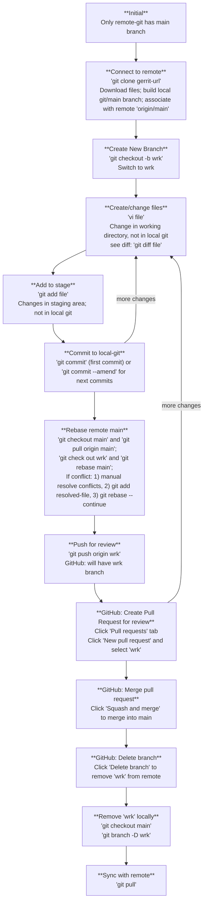

**Reference**: [YouTube - GitHub With Review Workflow](https://www.youtube.com/watch?v=uj8hjLyEBmU)

**Entities**:
  1. Remote-git: GitHub
  2. Local-git: Local repository
  3. Staging: `git add`
  4. Disk: Working directory

**Stages**:
  1. Initial:
     - Only the remote repository has the main branch.
  2. Clone to local: `git clone https://github.com/username/repo.git`
     - Local machine gets Git source control (.git folder and config files).
     - Both disk and local repository gets the main branch.
  3. Create a new branch: `git checkout -b wrk`
     - Local repository now has two branches: main and wrk.
     - Switches to `wrk` locally.
  4. Modify files on `wrk`: `vi <file>` or use VSCode
     - Changes are on disk, not yet in local-git.
     - To see changes: `git diff <file>`
  5. Add and commit the file:
     - Add to staging: `git add <file>`
     - Commit to local repository: `git commit -m "message"`
     - Amend commit (keep as one commit): `git commit --amend`
     - Local repository now has a new commit.
  6. Get updates from remote main:
     - main get update: `git checkout main` and  `git pull origin main`
     - wrk branch get new base from main. `git checkout wrk` and `git rebase main`
     - If conflict:
       - Resolve manually using `vi <conflict-file>` or VSCode.
       - Mark as resolved: `git add <resolved-file>`
       - Continue rebase: `git rebase --continue`
     - Note: `git rebase` will do 1) remove wrk commit, 2) apply new main 3) re-apply wrk commit (new commit ID).
  7. Push `wrk` to remote: `git push origin wrk`
     - Remote repository now has a new branch `wrk`.
  8. GitHub: Create a Pull request:
       - Click "Pull requests" tab
       - Click "New pull request" and select `wrk`
       - PR for review: https://github.com/sonnygithub2017/cheatsheets/pull/1
  9. Additional changes after review:
       - Make changes, `git add <file>`, then `git commit -m "more msg"`, then `git push origin wrk`
       - Existing Pull request will be updated.
  10. GitHub: Merge the Pull request
       - Review the pull request
       - Click "Squash and merge" to merge into main.
  11. GitHub: Delete branch
     - Click "Delete branch" to remove `wrk` from remote.
  12. Remove `wrk` locally:
      - Switch to main: `git checkout main`
      - Delete `wrk`: `git branch -D wrk`
  13. Update local main: `git pull origin main`

**Flowchart**

**Table summary**:
| Stage                 | Command                   | Disk               | Staging    | Local-git                         | Remote-git                              |
| --------------------- | ------------------------- | ------------------ | ---------- | --------------------------------- | --------------------------------------- |
| Initial               |                           | x                  | x          | x                                 | main init                               |
| Clone to local        | `git clone <github-url>`  | main init          | x          | main init                         | main init                               |
| Create branch         | `git checkout -b wrk`     | wrk init           | x          | *wrk init main init            | main init                               |
| Add/edit file         | (change) `git diff`       | wrk change         | x          | *wrk init                         | main init                               |
| Add to stage          | `git add <file>`          | wrk change         | wrk change | wrk init                          | main init                               |
| Commit                | `git commit -m "message"` | wrk change         | x          | wrk change                        | main init                               |
| switch to main        | `git checkout main`       | main init          | x          | *main init wrk change          | main update                             |
| Update main           | `git pull origin main`    | main update        | x          | *main update wrk change        | main update                             |
| switch to wrk         | `git checkout wrk`        | wrk change         | x          | *wrk change main update        | main update                             |
| Rebase main           | `git rebase main`         | wrk change         | x          | *wrk update-change                | main update                             |
| Push to wrk           | `git push origin wrk`     | wrk change         | x          | *wrk update-change                | wrk update-change main update        |
| create Pull request   | GitHub: "Pull request"    | wrk change         | x          | *wrk-update-change                | wrk-update-change main update        |
| more change (same PR) | git add/commit/push       | wrk change2        | wrk change2| *wrk-update-change2               | wrk-update-change2 main update       |
| merge Pull request    | GitHub: "Squash&Merge"    | wrk change2        | x          | *wrk-update-change2               | wrk-update-change2 main-update-change|
| delete branch(Github) | GitHub: delete wrk        | wrk change2        | x          | *wrk-update-change2               | main-update-change2                     |
| switch to main        | `git checkout main`       | main-update        | x          | *main-update wrk-update-change2| main-update-change2                     |
| Delete branch(local)  | `git branch -D wrk`       | main-update        | x          | main-update                       | main-update-change2                     |
| Update local          | `git pull origin main`    | main update-change2| x          | main-update-change2               | main-update-change2                     |
